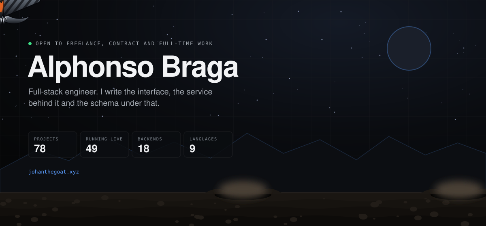
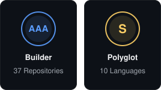

  <b>Full-stack engineer.</b> I write the interface, the service behind it and the schema under that,
   in whichever language the problem actually wants.

  
  
  
  

---

### What I build

Projects that run, not screenshots of projects. Forty-nine of them run in a browser tab and have to
hold their frame rate while they do it, driving hand and face tracking through WebGL particles or
compute shaders written in WGSL. The rest carry a real backend: schemas, migrations, HTTP APIs, a
CRDT that reconverges three offline replicas without a server deciding anything. Some are desktop
builds, some ship to Android, and one point of sale runs on a restaurant counter.

Every project states the problem, the approach and a measured result. The whole catalog builds from
one source tree into a single deployment and routes by hostname, so a case study can never link to a
stale copy of its own app.

---

### Selected work

| Project | What it is | Stack |
| :-- | :-- | :-- |
| **[Shelf Check](https://johanthegoat.xyz/work/shelf-check/)** | Type what each shelf label says and see which pack is really cheaper, with multi-buy offers counted and the bigger-pack trap flagged. Works offline in the shop. | JavaScript, PWA |
| **[EvenUp](https://johanthegoat.xyz/work/evenup/)** | Split group costs and settle up in the fewest payments, solved exactly with a subset dynamic program. Writes the pay-me-back message for you. | JavaScript, SVG |
| **[MindMesh Board](https://johanthegoat.xyz/work/mindmesh/)** | Jot ideas, link them, and tidy them with a force-directed layout. Keyboard first, a pasted list becomes a map, and deletes stay deleted across tabs. | JavaScript, SVG, BroadcastChannel |
| **[Rate Limit Lab](https://johanthegoat.xyz/work/ratelimit-lab/)** | Five rate limiting algorithms, an HTTP middleware that speaks the IETF RateLimit headers, and a simulator that runs them side by side. | JavaScript, Node |
| **[Idempotency Lab](https://github.com/johanthegoatt/idempotency-lab)** | An Idempotency-Key middleware for node:http built to the IETF draft, and a simulator that shows what retries do to a payments API with and without it. | JavaScript, Node |
| **[Lux](https://johanthegoat.xyz/work/lux/)** | A business operating system. A business signs up, picks its type, and gets a public site, a customer record, a booking or order flow and numbers that all know about each other. | Next.js, TypeScript, PostgreSQL |
| **[Kivo](https://johanthegoat.xyz/work/kivo/)** | A life operating system: one account holding Money, School, Commute, Life and Local, with a home brief that reads all five together to say what the day asks of you. | Next.js, TypeScript, PostgreSQL |
| **[Aegis Scan](https://johanthegoat.xyz/work/aegis-scan/)** | Defensive web-security assessment. Passive scans of headers, cookies, TLS, DNS and technology hints, graded A to F with a remediation report. | Next.js, Drizzle, PostgreSQL |
| **[ONNX Digit Lab](https://johanthegoat.xyz/work/onnx-digit-lab/)** | A 26 KB neural network classifying on device. The runtime walks WebGPU, then WebGL, then WASM, and reports where it landed instead of guessing. | ONNX Runtime Web, WebGL, WASM |
| **[WebGPU Vision Lab](https://johanthegoat.xyz/work/webgpu-vision-lab/)** | Four filters written twice, once as a Canvas2D loop and once as a WGSL compute shader, on the same webcam frame. Measured 22.8x on blur, 2.1x on Sobel. | WebGPU, WGSL, WebRTC |
| **[SAT0RU](https://johanthegoat.xyz/work/sat0ru/)** | Hand-tracked technique visualiser. A classifier reads 21-point landmarks per frame and votes across a rolling window, with a geometric fallback when confidence drops. | Three.js, MediaPipe, TensorFlow.js |
| **[Local-First Sync](https://johanthegoat.xyz/work/local-first-sync/)** | A last-writer-wins CRDT with vector clocks and causal delivery, written from scratch. Property-tested across 40 randomised edit-and-gossip orders. | JavaScript, CRDT, Node |
| **[UPCAT Reviewer](https://johanthegoat.xyz/work/upcat-reviewer/)** | Adaptive study system over 1,017 questions and 28 topics that learns which topics you are weak at and schedules what to review next. | PWA, IndexedDB, Service Worker |

<a href="https://johanthegoat.xyz"><b>All 78 projects</b></a>

---

### Latest updates

<!-- updates:start -->
**8 October 2026**: one new project and eight projects improved.

- **New: [Shelf Check](https://github.com/johanthegoatt/shelf-check)** finds the real best deal on a shelf: unit prices, multi-buy offers and big packs that cost more. Tag the price tag mascot helps you pick.
- **[MindMesh Board](https://github.com/johanthegoatt/mindmesh-board)**: Tidy up with a force-directed layout, Tab to add a linked idea, paste a list to build a map, deletes that stay deleted across tabs, and Pip the thought bubble.
- **[Load Shedding Lab](https://github.com/johanthegoatt/load-shedding-lab)**: client-side adaptive throttling from the Google SRE book, plus a README and a side by side comparison of every policy.
- **[Lux](https://github.com/johanthegoatt/lux)**: Sign out shows in the header once you're signed in, and account emails say to check spam.
- **[Kivo](https://github.com/johanthegoatt/kivo)**, **[Fairdev](https://github.com/johanthegoatt/fairdev)**, **[Pentest](https://github.com/johanthegoatt/pentest)** and **[Python Course Engine](https://github.com/johanthegoatt/python-course-engine)**: sign-in and account emails now tell people to check their spam folder.
<!-- updates:end -->

---

### Tech stack

**Languages**

  
  
  
  
  
  
  
  
  
  

**Front end**

  
  
  
  
  
  
  

**Back end and data**

  
  
  
  
  
  
  

**ML and vision**

  
  
  
  
  

**Platform and tooling**

  
  
  
  
  
  
  
  

---

### The numbers

  
  

  

---

### Contributions

  

---

### Trophies

  

---

<!-- Coding time: uncomment once WakaTime has recorded a few days of hours.
     Needs "Display coding activity publicly" enabled at wakatime.com/settings/profile

### Coding time

  

-->

  
  
  

